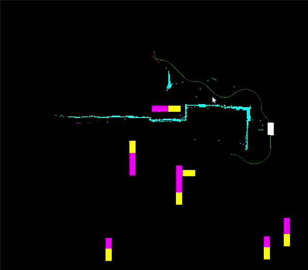

# Motion Planner for an Autonomous Vehicle in Unstructured Environment
The project provides a motion planning framework for navigation of an Autonomous Vehicle in an unstructured environment like a parking lot. 
The framework is comprised of a lattice-based weighted A* planner combined with short-term trajectory prediction to handle dynamic obstacles.  
The framework was tested on a virtual 100m x100m parking lot like environment and the average planning time over all the range of queries came out to about 1 second. 

A simple simulation for one of the queries is illustrated below.  
The white box represents the Agent Vehicle for which the motion planning is being done.  
The yellow moving boxes are dynamic obstacles.  
The purple extension in front of yellow boxes is the predicted hight cost area. 
The cyan small blocks are static environment obstacles. 

You can see the car replanning its way when predicted trajectory of another vehicle intersects with its originally planned path to the destination.

   
